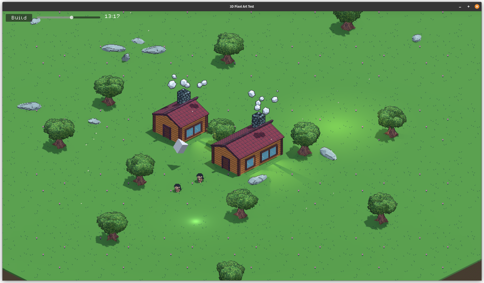

# Godot 3D Pixel Art

This is my approach at creating some 3D pixel art in Godot.

Take the project structure with a grain of salt as I am new to Godot.

## Basic Shader

The effect works primarily using `SCREEN_UV` combined with using the current screen size and texture size to calculate what the texture lookup should be. See `materials/isometric_basic.gdshader` for the simplest example of this.

Effectively I'm trying to use the screen space location of the vertices screen space location to paint
directly from a texture ignoring any actual 3D projection. This combined with the use of 3D models means that we should get clean 2D pixel art to the screen with the benefit of 3D lighting and shadows.

## Texture Atlas Shader

One downside of combining 3D models with 2D pixel art is properly lining up everything, my solution has been to use repeating textures from an atlas so that the responsibility for shapes is left entirely to the 3D model. This does remove some of the fine pixel perfect control that traditional pixel art gives. However the result also makes creating content much simpler.

## Outlines

Adding outlines is often a core element of pixel art so recreating the effect with using the texture atlas shader was important.

I firstly tried using a shader pass to create expanded inverted meshes which worked in a handful of situations but it was not consistent enough.

Secondly was to manually create them in Blender and then attempt to line up the cameras in both programs to tweak the vertices. This worked better but I could never get the two camera results to match closely enough to streamline the process.

I ended up making use of denovodavid's [3d-pixel-art-in-godot](https://git.sr.ht/~denovodavid/3d-pixel-art-in-godot) source to create the outline effect. I also used their code to help with snapping the location of the camera and movable objects.

## Assets

Base Character Sprite by GibbonGL: https://gibbongl.itch.io/8-directional-gameboy-character-template

Pixel Font Dogica by Roberto Mocci: https://www.dafont.com/dogica.font

Texel Matching Camera and Pixel Outline shader by David Holland: https://git.sr.ht/~denovodavid/3d-pixel-art-in-godot

Background Wind audio by kyles: https://freesound.org/people/kyles/sounds/637563/

Other sound effects by kronbits: https://kronbits.itch.io/freesfx

# Author

Alan Lawrey 2024